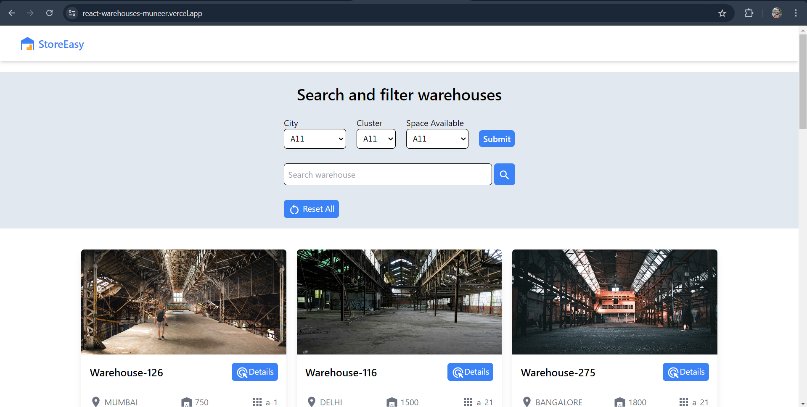
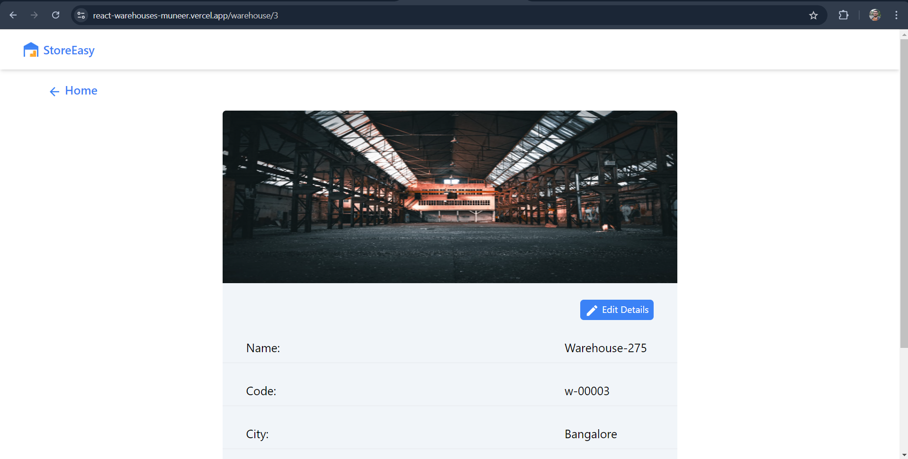

# Warehouses website

## Task overview

The task was to create a simple warehouses website which provides a listing of available warehouses.   The website should have filters based on categories such as city, space available. User should also be able to search warehouses and view and edit their details.

## Live Demo:

### [StoreEasy](https://react-warehouses-muneer.vercel.app/)

## Functionalities:

- Listing of warehouses
- Search functionality
- Filtering of warehouses based on different categories
- Viewing and editing details of individual warehouses

## Extra feature:

- Local storage implementation for edited warehouses

## Libraries and frameworks used:

- React JS
- redux
- Tailwind CSS
- mui
- react-router-dom

## Screenshots

### Home

## Property Detail

## Learning from this project:

- Learned optimal use of redux
- Learned efficient use of local storage
- Learned dynamic routing and useParams( ) hook of react-router-dom

## Future improvements

- Sort Warehouses based on price, size etc.
- Integrate booking process and payment.
